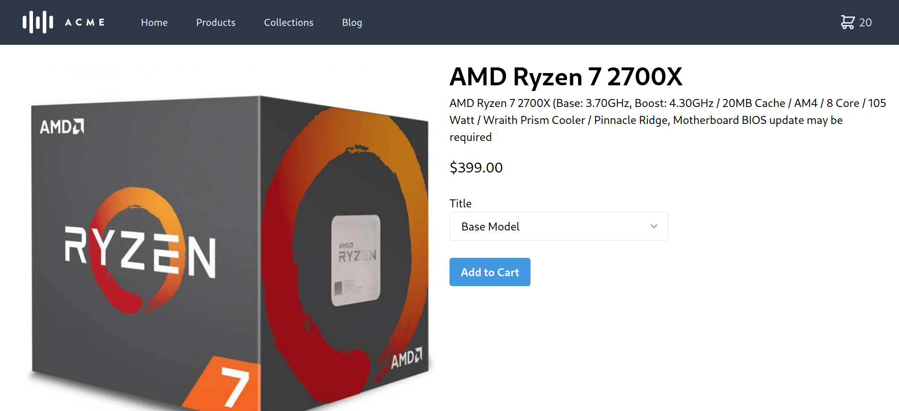

# Shopify Headless Site with Nuxt.js Example
This is a work in progress.  Will update as I get time.

When I was building my first Shopify Store I noticed there were a lot of gotchas. I wanted to make sure I was following best practice so that I could build a scalable shopify store.

Here's a couple of issues you might run into as you build your first store.
- Using asyncData vs fetch for products/pages/articles
- Clearing state across product page loads
- Shopify Product permisions vs Store front permissions 
- Checkout, and managing the CheckoutId
- How to effectively manage product attributes/badges like 'sale', 'fast shipping' throughout the site.

Here's some other features features we have out of the box.
- Automatic detection that product variants exist
- Automatic Colour Picker
- Static Site Deployment and automatically generate routes for all products/pages/articles


## Demo Site
[https://shopify-nuxtjs-starter.netlify.com](https://shopify-nuxtjs-starter.netlify.com/)




## Store configuration

Copy `.env.example` to `.env` and populate with your store details.

You will need to create a new private app under you store. 
https://**your-store-name**.myshopify.com/admin/apps/private

```
SHOPIFY_DOMAIN="store.myshopify.com"
SHOPIFY_ACCESS_TOKEN=XXXXXX
```

## We use a couple of projects under the hood.
- Nuxt.js Shopify Module (https://github.com/Gomah/nuxt-shopify)
- Cookie Universal Nuxt (https://www.npmjs.com/package/cookie-universal-nuxt)

## Build Setup

``` bash
# install dependencies
$ yarn install

# serve with hot reload at localhost:3000
$ yarn dev

# build for production and launch server
$ yarn build
$ yarn start

# generate static project
$ yarn generate
```
